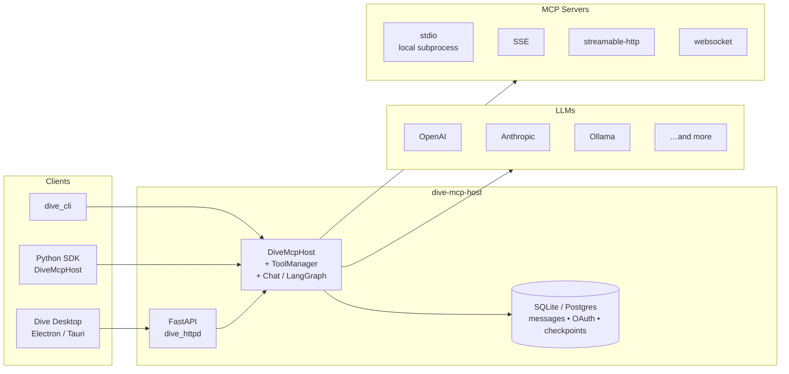
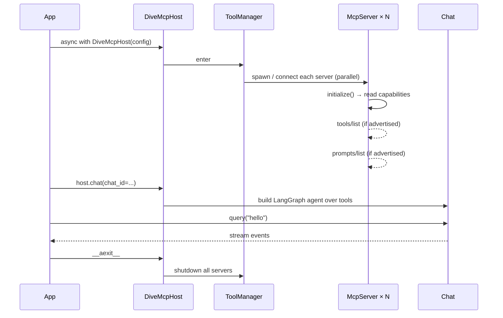

<div align="center">

# 🌊 Dive MCP Host

**A production-grade Python host for the Model Context Protocol — multi-LLM, multi-transport, spec-compliant.**

[](https://www.python.org/downloads/)
[](LICENSE)
[](https://spec.modelcontextprotocol.io/)
[](https://github.com/langchain-ai/langgraph)

*The Python brain behind the [Dive desktop app](https://github.com/OpenAgentPlatform/Dive) — also runnable standalone as a service or library.*

</div>

---

## ✨ Why Dive MCP Host?

The MCP ecosystem is growing fast, but most hosts are tightly coupled to a
single LLM, a single transport, or a single front-end. Dive MCP Host is the
opposite: a **transport-agnostic, model-agnostic** runtime that turns any
collection of MCP servers into a single agent backend.

- 🧠 **Any LLM** — OpenAI, Anthropic, Google, AWS Bedrock, Mistral, DeepSeek, Ollama, Azure OpenAI — anything LangChain speaks.
- 🔌 **Any MCP server** — `stdio`, `sse`, `streamable-http`, `websocket`, plus a "spawn-and-connect" local-HTTP mode.
- 🛰 **Three ways to use it** — embed the SDK, talk to the HTTP API, or drive it from the CLI.
- 🧩 **Spec-compliant capability negotiation** — calls `tools/list` / `prompts/list` only when the server advertises them; gracefully tolerates `Method not found`.
- 💬 **MCP prompts as first-class** — list, fetch, render, and refresh on `notifications/prompts/list_changed`.
- 🔐 **OAuth + elicitation built in** — interactive flows surface to the host without bespoke glue per server.
- 🗃 **Persistent threads** — SQLite or Postgres checkpointing via LangGraph; messages, OAuth tokens, and conversation state survive restarts.

---

## 🏗 Architecture at a Glance



The same `DiveMcpHost` core is reused by all three entry points. The HTTP
layer is a thin FastAPI wrapper; the CLI and SDK are even thinner.

### Lifecycle

Everything is an async context manager (`ContextProtocol`). Resources nest
strictly so cleanup is deterministic:



---

## 🚀 Quick Start

### Install

```bash
# Recommended: uv (respects uv.lock)
uv sync --frozen

# Or with pip
pip install -e .

# With dev tools (pytest, ruff, …)
uv sync --extra dev --frozen
```

Requires **Python 3.12+**.

### Run the HTTP service

```bash
dive_httpd
```

Serves on `0.0.0.0:61990` by default. Configure via `dive_httpd.json` (DB,
checkpointer, CORS).

### Try the CLI

```bash
dive_cli "Summarize today's news"
dive_cli -c CHAT_ID "and what about tech?"   # resume a thread
```

### Embed in Python

```python
from dive_mcp_host.host.host import DiveMcpHost
from dive_mcp_host.host.conf import HostConfig

config = HostConfig(...)  # see model_config.json / mcp_config.json samples

async with DiveMcpHost(config) as host:
    async with host.chat(chat_id="demo") as chat:
        async for event in chat.query("hello"):
            print(event)
```

---

## ⚙️ Configuration

Three JSON files drive the service. Samples are at the repo root.

<details>
<summary><b>📄 <code>mcp_config.json</code></b> — which MCP servers to mount</summary>

```json
{
  "mcpServers": {
    "fetch": {
      "transport": "stdio",
      "command": "uvx",
      "args": ["mcp-server-fetch@latest"]
    },
    "weather": {
      "transport": "streamable",
      "url": "https://example.com/mcp"
    }
  }
}
```

Supported `transport` values: `stdio`, `sse`, `streamable`, `websocket`.
Add `"command"` together with `"url"` to spawn a local HTTP MCP server
and connect to it.

</details>

<details>
<summary><b>📄 <code>model_config.json</code></b> — which LLM to use</summary>

```json
{
  "activeProvider": "ollama",
  "configs": {
    "openai":     { "modelProvider": "openai",    "model": "gpt-4o-mini", "apiKey": "..." },
    "anthropic":  { "modelProvider": "anthropic", "model": "claude-sonnet-4-5" },
    "ollama":     { "modelProvider": "ollama",    "model": "qwen2.5:14b",
                    "configuration": { "baseURL": "http://localhost:11434" } }
  }
}
```

</details>

<details>
<summary><b>📄 <code>dive_httpd.json</code></b> — HTTP service settings</summary>

```json
{
  "db":           { "uri": "sqlite:///db.sqlite", "async_uri": "sqlite+aiosqlite:///db.sqlite", "migrate": true },
  "checkpointer": { "uri": "sqlite:///db.sqlite" },
  "cors_origin":  "http://localhost:5173"
}
```

</details>

---

## 🧩 MCP Capability Support

Dive negotiates capabilities **per the MCP spec**: each server's
`initialize` response is inspected, and only the advertised endpoints are
queried. This protects you from the entire class of "host crashes because
server doesn't implement X" bugs.

| Capability | Behavior |
| --- | --- |
| `tools` 🔧 | Listed at startup, exposed to the LLM, dispatched via `call_tool`. |
| `prompts` 💬 | Listed at startup, cached, refreshed on `notifications/prompts/list_changed`. Surfaced via `McpServerInfo.prompts` and the `/api/tools` response. |
| `resources` 📦 | Discovery wired up; expose as needed by your front-end. |
| OAuth 🔐 | Full authorization-code + dynamic-client-registration flow with persistent token store. |
| Elicitation 🗨 | Server-initiated prompts surface to the front-end via the elicitation manager. |
| `Method not found` ⚠️ | Treated as "server doesn't support that"; never breaks initialization. |

### Prompts HTTP API

```http
GET  /api/tools/{server}/prompts          # list (?refresh=true bypasses cache)
POST /api/tools/{server}/prompts/get      # body: {"name": "...", "arguments": {...}}
```

Both endpoints return the repo-standard `DataResult[T]` envelope
(`{success, message, data}`); `data` is the list of prompts or the
rendered `GetPromptResult` (description + ordered `PromptMessage`s)
ready to append to a chat thread.

---

## 🔭 HTTP API Map

| Prefix | Purpose |
| --- | --- |
| `/api/chat` | Streaming chat, message history |
| `/api/v1/mcp` | Remote MCP-style endpoints (re-mount of `/api/chat`) |
| `/api/tools` | Server inventory, prompts, OAuth, elicitation, log stream |
| `/api/config` | Hot-reload MCP and model config |
| `/api/skills` | Markdown-defined skills (with frontmatter) |
| `/v1/openai` | OpenAI-compatible chat completion endpoint |
| `/model_verify` | One-shot credential check for an LLM provider |

---

## 🧪 Development

```bash
# Install dev deps
uv sync --extra dev --frozen

# (Optional) local Postgres for tests/dev
./scripts/run_pg.sh

# Run the full suite
pytest

# Single test
pytest tests/test_tools.py::test_mcp_server_info

# Integration tests only
pytest -m integration

# Lint & format (ruff is the only tool you need)
ruff check .
ruff format .

# DB migrations
alembic upgrade head
alembic revision --autogenerate -m "describe change"
```

Without activating the venv:

```bash
uv run --extra dev --frozen pytest
```

---

## 🤝 Contributing

This repo is the Python backend of the [Dive desktop
app](https://github.com/OpenAgentPlatform/Dive). PRs that change wire
formats must stay backwards-compatible with shipped Dive builds — favor
additive fields and new endpoints over breaking existing ones.

## 📜 License

MIT — see [LICENSE](LICENSE).
